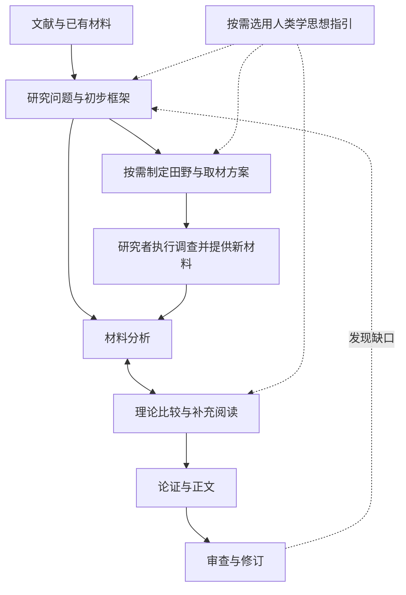

# 文科社科论文研究 Skill v1.3 使用说明

技能名称：`humanities-social-research`  
适用版本：v1.3  
更新日期：2026年10月3日

这套 Skill 用于协助完成文科与社会科学论文的研究过程：搜集与阅读文献、发现问题、制定田野调查方案、整理材料、形成分析框架、推进理论解释，最后写成有证据支撑的论文。当前以中文质性研究和民族志取向为主，同时支持文本细读、史料研究与理论论证。

v1.3在已有研究流程上加入项飙、王铭铭、费孝通的思想指引。它把相关启发落实为阅读、提问、观察、比较和修订解释的动作，并保留原作出处与适用边界。

你可以让它推进整个项目，也可以只处理当前的一项任务。不必先掌握技能内部的模块编号。

## 一 快速开始

在当前已安装该技能的环境中，输入下面的提示词，并附上材料或可访问的文件路径：

```text
请使用 $humanities-social-research。

我的研究兴趣是：[主题或具体困惑]。
目前进度是：[刚开始读文献／准备调查／已有田野／已有草稿]。
现有材料是：[文件或文件夹]。
本次希望完成：[问题提炼／调查方案／材料分析／正文等]。
已经确定的要求是：[如有，填写理论、时期、篇幅或导师要求]。

请从当前阶段开始，说明实际读取范围，完成证据允许的工作。
题目和框架可以提出调整建议，但要说明理由。
```

方括号是供你填写的信息，不必全部填满。信息不足时，技能会先完成可以开展的工作，并说明需要暂定的条件。

| 你目前的情况 | 可以直接提出的任务 | 主要产物 |
|---|---|---|
| 只有研究兴趣 | 帮我检索相关研究，找出可以追问的具体问题 | 检索结果、候选问题、材料需求 |
| 已有一批论文 | 阅读全文，比较解释，提炼问题 | 阅读记录、综述、问题与框架 |
| 准备做田野 | 把文献缺口转成具体调查方案 | 对象筛选、提纲、观察与文书清单、日程 |
| 已有访谈和笔记 | 分析其中的关系、过程、差异与矛盾 | 可回查片段、案例分析、解释备忘录 |
| 想学习人类学方法 | 结合材料选择思想入口，安排阅读练习 | 视角比较、具体追问、学习练习 |
| 已有论文草稿 | 检查论证并做实质性修改 | 问题诊断、修订稿、关键改动说明 |

只想完成一项工作时，明确说“本次只做文献分析”或“先给调查方案”。希望继续推进时，可以说“做到现有证据允许的正文阶段”。

## 二 全流程怎样衔接

它采用“一个统一入口＋按需加载的阶段模块”。研究过程可以往返：新材料可能改变问题，反例可能促使理论调整，写作也可能暴露需要补访的环节。



九个工作模块负责不同阶段：

| 模块 | 主要工作 | 按需形成的产物 |
|---|---|---|
| 01 项目与证据记录 | 清点材料、记录来源与阅读覆盖、续接项目 | 材料索引、研究状态 |
| 02 文献搜集与获取 | 检索、筛选、获取全文、追踪引文 | 检索日志、书目、访问与阅读缺口 |
| 03 精读与综合 | 分析概念、材料、方法和推理，比较文献 | 阅读卡、概念辨析、文献综述 |
| 04 问题与框架 | 将兴趣转成可回答的问题，选择分析单位与方法 | 候选题目、问题说明、分析框架 |
| 10 田野调查设计 | 将问题与缺口落实为调查行动 | 选点、选人、进入路径、工具与排程 |
| 05 田野材料分析 | 保留语境，分析场景、事件、关系和差异 | 分析备忘录、案例或主题分析 |
| 06 理论与贡献 | 说明理论怎样解释材料，比较替代解释 | 理论比较、解释记录、贡献与边界 |
| 07 成文与修订 | 组织论证、起草、修改、回应评阅 | 提纲、正文、修订稿 |
| 08 人文学科分支 | 针对文本、史料与理论任务调整方法 | 细读、史料互证、概念论证 |

另有三个辅助文件：09是合成材料分析示例；11是跨阶段的人类学思想指引；12记录思想指引的出处与核读范围。文件编号用于内部组织，不代表你必须按编号完成研究。

分析框架会区分“用什么视角看”“观察什么关系”“怎样取材与分析”和“章节怎样论证”。章节目录本身不等于分析框架。

## 三 怎样使用人类学思想指引

思想指引用来帮助提出问题和改进研究动作。当前版本根据三位学者部分原作章节、本人论述和访谈作选择性提炼，没有声称覆盖他们的全部思想。

### 三个入口怎样选择

下表是 Skill 对相关思想的操作性转化，不是学者原话或他们提出的统一研究流程。原作依据与阅读边界见[出处说明](humanities-social-research/references/12-anthropological-sources.md)。

| 入口 | 什么情况下有帮助 | 会怎样改变研究动作 | 需要避免什么 |
|---|---|---|---|
| 项飙：具体处境与当事人的关切 | 主题很大，却说不清参与者实际困惑 | 从一个事件出发，追踪不同位置者的担忧、选择、劳动和相互依赖 | 把“附近”想成温暖熟人共同体；以自己的感受代表他人 |
| 王铭铭：地方、历史与更广关系 | 地方被写成封闭单位，历史只作背景 | 追踪人、物、文书与制度的联系，将地方材料与历史、区域研究互读 | 没有传承证据就从古代思想推出现代实践；把地方直接当作文明缩影 |
| 费孝通：关系差异与类型比较 | “关系”“诚信”或“文化”成了笼统解释 | 比较不同关系对象的责任、通融和代价，检查比较条件及变化 | 预设关系越近越宽容；用一个案例概括全部中国社会 |

没有指定学者时，技能按当前问题选择相关入口。指定三位学者时，会比较各自能提出什么追问，再说明取舍；不会要求每篇论文把三人全部用上。你已明确采用的其他理论与方法仍然优先。

### 一次有用的思想运用应交付什么

你应能看见：采用了哪个视角及其出处；它为什么适合当前材料；它增加或改变了什么问题；需要补充什么证据；什么情况会使这个视角失效。

例如，关于赊账的材料若出现“对亲属反而催得更紧”，技能应进一步检查亲属义务、现金压力、交易金额及履约经历，而不能仅贴上“差序格局”的标签就结束分析。这里是方法示例，不是温州田野发现。

输出会分清三层：**原作论述、Skill设计的研究动作、当前课题的候选解释**。如果某个概念要承担论文的中心论证，还应核读相应原作与所用版本，不能把技能中的概括直接当作原典引用。

### 学习方法怎样落实

这些练习由 Skill 设计，可按当前困难选用，不冒称学者本人的固定学习法。

| 练习 | 具体做法 | 留下的成果 |
|---|---|---|
| 说清经验 | 先不用理论术语复述真实材料中的一个事件，列出无法解释的环节 | 事件说明与待问问题 |
| 重建推理 | 阅读一篇文章或章节，找出作者如何从材料形成概念和判断 | 问题—材料—推理—结论记录 |
| 历史互读 | 比较同一做法的回忆、同期记录和既有研究 | 时间线、材料分歧与各自用途 |
| 用反例修订 | 用一个结果不同或条件不同的案例检查现有解释 | 修改后的判断及成立条件 |

目标是让每次阅读或调查都能回答：“我原来怎样理解，什么材料改变了理解，下一步要读什么或问什么？”

## 四 怎样得到可以执行的田野方案

当文献提出了一个解释，却没有说明关键过程时，可以要求技能把缺口转成调查任务。它会建立如下对应：

**文献判断及位置 → 缺少哪一环证据 → 研究问题 → 所需材料 → 找谁、去哪里、做什么 → 哪些结果会改变解释。**

一份具体方案按课题需要包含：

| 方案部分 | 应写清的内容 |
|---|---|
| 范围与条件 | 分析单位、时期、地点、可用天数、人员、预算与已有关系 |
| 选点与选人 | 纳入条件、角色差异、比较理由、反常或失败经历 |
| 进入路径 | 候选渠道、邀约草稿、资格筛选、访问失败后的替代办法 |
| 调查工具 | 分角色访谈问题、观察情境、文书清单与核实字段 |
| 工作安排 | 接洽、交通、试访、取材、当日整理和复盘 |
| 调整规则 | 何时换对象、追访、补档案、改问题或收缩结论 |
| 分析衔接 | 每类拟收材料将服务哪项比较、解释或论文论证 |

提供资源条件会使方案更实用。条件未定时，技能可以先给明确标注假设的试点方案；不会把设计估计写成你已经确定的计划。人数、访谈次数、事件数量和文书数量分开记录，短期试点不自动证明理论饱和。

历史研究尤其要区分：今天的现场观察、关于过去的回忆、同期形成的文书。现任经营者是否亲历早期交易，需要筛选；当前的经营方式不能直接当作几十年前的证据。

调查方案、已联系、已实施和已分析分别记录。技能可以帮助准备邀约和工具，实际参与、访问许可及新材料需要另行落实；未实施的计划不能写进论文方法部分。

## 五 材料怎样准备与核查

### 提供材料时带上什么信息

| 材料 | 有助于分析的附加信息 |
|---|---|
| 论文、书章 | 原文件、版本、已有书目、重点问题 |
| 访谈 | 人物代号、访谈时间、相关背景、逐字稿或节录、时间戳（如有） |
| 田野笔记 | 记录时间、场景、在场关系；观察与后来解释尽量分开 |
| 历史材料 | 来源、形成时间、保存或编辑情况 |
| 文学或文化文本 | 作品、版本、译本、分析范围 |
| 草稿与评阅意见 | 当前稿件、具体意见、已确定的选择及可调整部分 |

信息不全仍可开始，未知项应保留。音视频、扫描件或复杂格式的处理依赖当前环境可用工具；技能本身不附带数据库订阅、转录服务或全文访问权限。

原始文件保留原貌，整理稿和正文另存。人物可使用代号，身份映射单独保存；外部检索使用必要主题词，不默认上传私有访谈全文。

### 怎样看阅读与证据状态

“确认论文存在”“只读摘要”“读过部分章节”和“阅读全文”是不同状态。全文阅读也不表示文中全部数字、引用与转引都已追到原源。你可以要求查看来源索引和实际阅读范围。

对每项关键判断，还要分别说明它得到支持、部分支持、被反对，还是证据不足。同一篇论文可以支持一项判断，同时不支持另一项。

特别需要检查四类问题：扫描与文字提取是否遗漏；发表、事件和回忆的时间是否混淆；多篇论文是否转述同一来源；相近概念是否被当作同一现象。例如，“口头形式”“关系治理”和“履约结果”各自需要证据，不能相互替代。

## 六 可直接复制的提示词

以下提示词可以按需缩短。附上真实文件，并将方括号替换成实际信息即可。

### 1 阅读文献并发现问题

```text
请使用 $humanities-social-research，阅读我提供的文献。
说明实际读取范围，比较问题、概念、材料与解释分歧，
提出值得研究的问题，说明已有依据、证据缺口与可能贡献。
不要只逐篇总结；必要时可建议调整我的题目。
```

### 2 制定田野调查方案

```text
请使用 $humanities-social-research，结合已读论文与当前问题，
把证据缺口转成可以执行的田野方案。
请写明对象筛选、进入方式、分角色提纲、观察与文书清单、日程及调整条件。
我的资源条件是：[天数、人员、预算、已有联系人角色及进入条件]。
未知条件请标为假设，区分计划与已实施工作。
```

### 3 运用人类学思想指引

```text
请使用 $humanities-social-research，结合这些材料，
比较项飙、王铭铭、费孝通的相关思想能提出什么不同问题。
选择适合本题的入口，说明它改变哪些分析、访谈、观察或史料取材。
区分原作观点、方法转化和本题解释，保留反例，并说明不适用处。
```

### 4 学习一位学者的研究方法

```text
请使用 $humanities-social-research，以我提供的[作者及文章/章节]为起点，
重建作者从经验困惑到材料、概念和结论的推理过程。
结合我的课题设计一个可完成的阅读或分析练习，并示范如何检查结果。
练习若由你设计，请明确说明，不冒称作者本人的固定学习方法。
```

### 5 分析访谈和田野笔记

```text
请使用 $humanities-social-research，分析这些访谈和田野笔记。
保留人物关系、场景与前后语境，找出值得解释的差异和矛盾。
根据问题和资料选择适合的方法，完成一组可回查的实质分析，
并说明哪些材料需要补充，哪些初步判断应当修改。
```

### 6 推进理论解释与正文

```text
请使用 $humanities-social-research，比较哪些理论能解释现有材料。
说明概念与材料怎样对应，哪些证据不符合，还有什么竞争解释。
据此组织论证并写出证据允许的正文，保留关键缺口，
方法部分只写实际进行过的研究。
```

### 7 根据导师意见修订

```text
请使用 $humanities-social-research，结合稿件和导师意见做实质性修订。
优先处理问题、概念、证据与推理之间的断裂，再修改语言。
核心判断改变时，同步检查摘要、引言、分析与结论，说明关键改动。
```

### 8 接续已有项目

```text
请使用 $humanities-social-research，先读项目研究状态与来源索引。
本次新增材料是：[路径或文件]；本次希望完成：[任务]。
检查新材料是否改变已有问题或解释，回查有关原文并更新分析与稿件。
不必重做已经完成且没有变化的工作。
```

## 七 温州口头契约课题怎样使用

你原来的研究兴趣是“经济人类学视域下口头契约对温州早期民营经济的影响”。使用当前版本时，可以从已有文献与研究状态接续。

| 阶段 | 本课题可以完成的工作 |
|---|---|
| 阅读与辨析 | 分清口头约定、书面记录、关系治理和履约结果，检查文献中的事件年代与转引来源 |
| 提炼问题 | 将宏观“经济影响”收敛到材料能回答的交易过程、责任与适用条件 |
| 选择视角 | 比较当事人担忧、地方与历史联系、不同关系中的责任差异分别带来什么追问 |
| 制定调查 | 筛选早期交易亲历者，重建具体事件，核对账本、单据或其他同期材料 |
| 分析与成文 | 比较成立和失效的情形，解释承诺怎样得到承认或追责，限定结论范围 |

可供检验的题目方向之一是：**口头约定如何成为可追责的承诺？——温州早期民营交易中的关系、文书与履约实践**。这仍是候选题目，“可追责”是否存在、何时成立、对谁有效，都需要材料回答。

当前已有的27篇文献阅读支持前期问题与框架工作，但尚无用户原始田野的完整分析。已有田野执行方案中的7日安排是设计假设，思想应用示例中的追问是拟议研究动作，都不属于已完成的调查。

完整研究报告、田野执行方案及扩展示例保存在作者本地研究项目中；本包提供技能本体与使用说明。

## 八 交付、续接与完成判断

未指定格式时，默认交付可编辑的 Markdown。需要 Word、PDF 或 LaTeX 时，可在请求中说明，由当前环境的对应工具生成。短任务可以直接在回复中交付；较长项目可按需保存：

```text
研究项目/
├── research-state.md   研究选择、进度、解释变化与下一步
├── sources.md          来源、读取范围与定位方式
├── reading/            阅读卡与综述
├── fieldwork-plan.md   调查方案及实施状态
├── analysis/           材料分析、理论比较与证据对应
└── drafts/             提纲、正文与修订稿
```

这些文件属于研究项目，不必存进技能安装目录。已有目录结构可以沿用。采用思想指引时，可在研究状态里记录所用视角、出处、改变的研究动作及其边界。

检查产物时，可以看五件事：问题是否明确；材料是否能回查；概念与材料之间是否有推理；反例和其他解释是否得到处理；结论是否超出证据。

材料充足时可继续成文；材料不足时，应交付能够成立的分析或部分正文，并指出缺哪一环。文本细读和史料研究不必强制编码；访谈研究也不自动等于扎根理论。理论贡献需要说明本研究具体增加或修正了什么认识，不以大词或名家姓名代替论证。

## 九 版本验证与文件入口

| 版本 | 已完成的检查与试跑 | 仍未证明的部分 |
|---|---|---|
| v1.1 | 温州课题27篇文献、98个PDF页的阅读及前期研究产物 | 完整原始田野分析、整篇实证论文及投稿效果 |
| v1.2 | 结构校验；单人4日、联系人资格未知的调查设计试跑 | 现场进入成功率和实际调查成效 |
| v1.3 | 结构校验；合成材料下两小时补访的思想运用试跑 | 三位学者的完整思想体系、所有课题的普遍适用性 |

上述验证记录保存在作者本地项目中。合成材料只用于行为检查，不是论文证据。

常用入口：

- [技能主文件](humanities-social-research/SKILL.md)
- [人类学思想指引](humanities-social-research/references/11-anthropological-orientation.md)
- [思想出处与阅读边界](humanities-social-research/references/12-anthropological-sources.md)
- [田野调查设计模块](humanities-social-research/references/10-fieldwork-design.md)
- [田野调查方案模板](humanities-social-research/assets/fieldwork-plan.md)

本说明依据当前安装文件编写。后续升级后，以届时的技能主文件与对应模块为准。本包中的技能文件使用相对链接，可在仓库内浏览。
